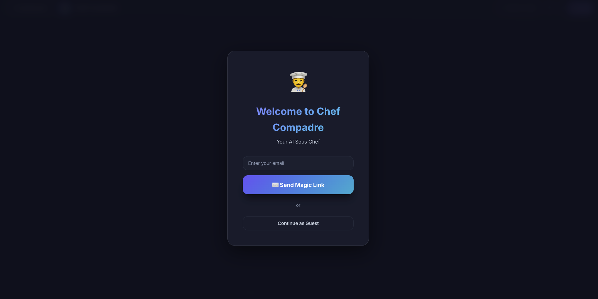
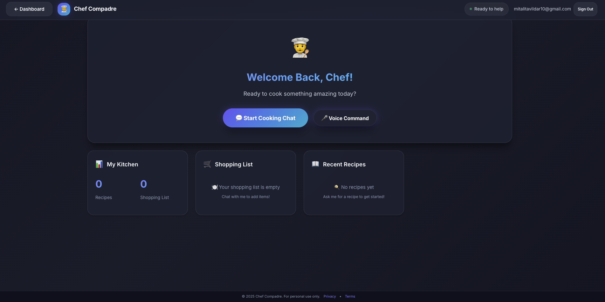

# 🍳 Chef Compadre — AI Cooking Assistant

<div align="center">


**Your intelligent sous chef powered by Google Gemini AI**

[🚀 Try Live Demo](https://chef-compadre.vercel.app/) • [Features](#-features) • [Tech Stack](#-tech-stack) • [Setup](#-setup)

</div>

---

## 🚀 Quick Start

**Try it now**: [https://chef-compadre.vercel.app/](https://chef-compadre.vercel.app/)

1. Visit the app (guest mode available)
2. Click "💬 Start Cooking Chat" and ask any cooking question
3. Try voice commands with "🎤 Voice Command"
4. Explore recipes, shopping lists, and more via sidebar

**Example queries**: "How do I make fried rice?", "Show me pasta carbonara", "I'm vegetarian, suggest protein options"

---

## 📖 Overview

**Chef Compadre** is a full-stack AI cooking assistant powered by Google's Gemini AI. It provides conversational cooking guidance, voice commands, visual references, recipe management, and smart shopping lists.

### Key Highlights

- 🎙️ **Voice-first interaction** with real-time transcription and TTS
- 🧠 **Context-aware conversations** with persistent memory
- 🖼️ **Visual intelligence** for reference images
- 🛒 **Smart shopping lists** and recipe saving
- 🔒 **Secure authentication** with magic links or guest mode

---

## ✨ Features

| Feature | Status | Description |
|---------|--------|-------------|
| **Conversational AI** | ✅ Live | Natural language cooking assistance with Gemini 2.5 Pro |
| **Voice Commands** | ✅ Live | Real-time speech-to-text with customizable TTS |
| **Reference Images** | ✅ Live | Visual references via Google Search integration |
| **Recipe Memory** | ✅ Live | Save and recall recipes with ingredients and steps |
| **Shopping Lists** | ✅ Live | Auto-generated from recipe conversations |
| **User Dashboard** | ✅ Live | Track recipes, shopping lists, and stats |
| **Authentication** | ✅ Live | Magic link authentication or guest mode |
| **Image Analysis** | 🚧 Soon | Upload food images for AI analysis |
| **URL Learning** | 🚧 Soon | Extract recipes from cooking websites |

---

## 🛠️ Tech Stack

**Frontend**: Vanilla JavaScript (ES6+), HTML5/CSS3, Web APIs (Speech Recognition, TTS)  
**Backend**: Node.js serverless functions on Vercel  
**AI**: Google Gemini 2.5 Pro (conversational & vision)  
**Database**: Supabase (PostgreSQL) with Row Level Security  
**Deployment**: Vercel serverless functions

**Key Libraries**: `@google/generative-ai`, `@supabase/supabase-js`, `formidable`

---

## 📸 Screenshots

### Landing Page

*Welcome screen with authentication options*

### Dashboard

*Personalized dashboard with kitchen stats*

### 🎬 Live Demo

**🌐 Try it now**: [https://chef-compadre.vercel.app/](https://chef-compadre.vercel.app/)

Use **Guest Mode** for immediate access or **Magic Link** for full features.

---

## 🚀 Setup

### Prerequisites

- Node.js 18+
- Vercel CLI
- Google Gemini API key
- Supabase account

### Quick Setup

```bash
# Clone repository
git clone https://github.com/mitali1045/cookalong-public.git
cd cookalong-public

# Install dependencies
npm install

# Set up environment variables (.env.local)
GEMINI_API_KEY=your_key
SUPABASE_URL=your_url
SUPABASE_ANON_KEY=your_key
SUPABASE_SERVICE_ROLE_KEY=your_key
MAGIC_LINK_REDIRECT_URL=http://localhost:3000

# Set up database (run setup_database.sql in Supabase)

# Run locally
npm run dev
```

---

## 📁 Project Structure

```
cookalong-public/
├── api/                    # Serverless functions
│   ├── conversation_consolidated.js
│   ├── analyze_image.js
│   ├── learn_url.js
│   └── auth.js
├── static/                 # Frontend files
│   └── voice_image_beta.html
├── setup_database.sql      # Database schema
└── vercel.json            # Vercel config
```

---

## 🔐 Security

- Environment variables stored securely in Vercel
- Row Level Security (RLS) for user data isolation
- Content filtering and safety guardrails
- HTTPS-only production deployment

---

## 📝 License

Copyright (c) 2024 Mitali Tavildar. All rights reserved.

This software is proprietary. Unauthorized copying, modification, distribution, or use is strictly prohibited.

---

## 👤 Author

**Mitali Tavildar**
- LinkedIn: [mitali-tavildar](https://www.linkedin.com/in/mitali-tavildar/)
- Email: mitalitavildar10@gmail.com

---

<div align="center">

**Built with ❤️ for cooking enthusiasts**

⭐ Star this repo if you find it interesting!

</div>
